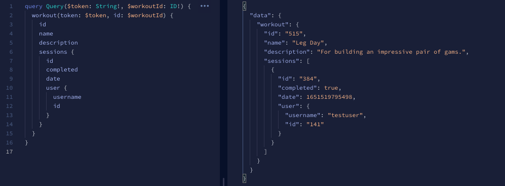

# Workout App

A full stack app for users to create and track their gym workouts.

The app uses Apollo GraphQL for the API layer while maintaining a local data cache via Redux.

---

#### Tech Used

### [Server](https://github.com/msolorio/workout-app)
- Node
- GraphQL / Apollo
- Prisma ORM
- PostgreSQL

### [Client](https://github.com/msolorio/workout-app-client)

- TypeScript
- React
- Redux - Redux toolkit
- GraphQL / Apollo

#### [Expand Image - Right click to open in new tab](https://raw.githubusercontent.com/msolorio/workout_app/main/readme-assets/workout-app-architecture.png)


---

## Tech of Note [WIP]

### Client Data Strategy

<details>
  <summary>Learn More</summary>

<br>

Enabled persistent data storage with Apollo GraphQL hooks while maintaining a local cache of user's data via Redux.
- Decreased load on the server by [xxx%].
- Enabled nearly instantaneous performance for data reads.
- Allows for optimistic updates as a future feature - updating user data and creating new records client-side without waiting for a response from the server.

<br>

#### [Expand Image - Right click to open in new tab](https://raw.githubusercontent.com/msolorio/workout_app/main/readme-assets/client-data-strategy.png)


**Note:** Apollo GraphQL offers caching and one could say Redux was not necessary for this use case. I chose to implement Redux to practice coordinating the two data stores and to allow for optimistic updates as a future feature.

</details>

---
<!-- - On client
  - Error handling for GraphQL requests
    - Implemented a custom error handling mechanism as
    - an opportunity to more deeply understand error handling with GraphQL -->


### Client Organization

<details>
<summary>Learn More</summary>

<br>

Implemented separate layers for data interaction and component UI, mimicking MVC architecture. Container components managed high level coordination of page level tasks. Various model layers oversaw implementation details of working with data.

#### [Expand Image - Right click to open in new tab](https://raw.githubusercontent.com/msolorio/workout_app/main/readme-assets/client-mvc.png)


#### Models - Redux and GraphQL Models
- For abstracting away vendor specific code for Apollo GraphQL and Redux
- Housing client-side error handling for GraphQL queries and mutations
- Uses React Hooks

#### Models - Client Operations Models
- For managing implementation details of communication between GraphQL and Redux
- Presenting high level operations to the controllers
- Uses React Hooks

#### Container Components (Controllers)
- Retrieving data from the URL
- Calling model methods for setting and retrieving data
- Managing local component state
- Handling events
- Handling redirects
- Pulling in UI and passing data

#### Presentation Components (View)
- Presenting data and styled UI

<br>

#### Code Example - Right click to open in new tab

The CreateWorkout container

[See full code](https://github.com/msolorio/workout_app_client/blob/main/src/pages/ShowWorkout/index.tsx)
```typescript
function CreateWorkout(): JSX.Element {
  const createWorkout = model.Workout.useCreateWorkout()

  const stateObj: State = {
    workoutId: null
  }

  const [state, setState] = useState(stateObj)


  const handleCreateWorkout = async (workoutData: WorkoutType) => {
    const createdWorkout: WorkoutType = await createWorkout(workoutData)

    if (createdWorkout.id) {
      setState({ workoutId: createdWorkout.id })
    }
  }

  if (state.workoutId) return <Redirect to={`/workouts/${state.workoutId}`} />

  return (
    <CreateWorkoutUi handleCreateWorkout={handleCreateWorkout} />
  )
}
```

`useCreateWorkout` method creates a workout with Apollo GraphQL, then stores in Redux. To integrate with Apollo hooks, I used hooks to manage model methods. The `useCreateWorkout` hook is called at the component's top level and returns a function that can be invoked in an event handler.

[See full code](https://github.com/msolorio/workout_app_client/blob/main/src/model/resources/Workout/index.ts)

```typescript
...
useCreateWorkout() {
  const createWorkoutGql = gql.Workout.useCreateWorkout()
  const createWorkoutRdx = rdx.Workout.useCreateWorkout()

  async function createWorkout(workoutData: WorkoutType): Promise<WorkoutOrErrorType> {
    const newWorkout = await createWorkoutGql(workoutData)

    if (!newWorkout.error) {
      createWorkoutRdx(newWorkout)
    }

    return newWorkout
  }

  return createWorkout
},
...
```

</details>

---

### Apollo GraphQL Server

<details>
  <summary>Learn More</summary>

Set up a 5-model GraphQL API enabling complete flexibility in traversing of data on the client.
- Allows for adding workout progress analysis features in the future, where complex data fetching would be required. For example, a feature could allow a user to see their progress on a per workout or per exercise basis.

#### [Expand Image - Right click to open in new tab](https://raw.githubusercontent.com/msolorio/workout_app/main/readme-assets/workout-app-erd.png)


The client can specify the exact data it needs. Shown is a query requesting data for a workout, sessions associated with the workout, and users associated with each session. All recieved within a single request / response cycle.



I found setting up the Apollo GraphQL server to be intuitive and a joy to work with. I find the prospect of complete data flexibility exciting. I'm interested in using GraphQL more and learning more about the problems it solves in the real-world.

</details>

---


### Server Organization

<details>
  <summary>Learn More</summary>

Decoupled the GraphQL API layer from data fetching layer allowing for easy repurposing of components. GraphQL could be switched out for a REST API, or the Prisma / Postgres model could be switched out to accomodate a different database.

#### Code Example
Below shows the resolver and model layer for creating a workout.

**Note:** In the model, closure is used to wrap the model method and grant it error handling with `createHandledQuery`.

```js
// Resolver Code
...
  createWorkout: async (parent, args, context) => {
    const modelArgs = {
      ...args,
      userId: context.userId
    }

    const { createdWorkout } = await Workout.createWorkout(modelArgs)

    return createdWorkout
  },
...

// Model Code
...
async function query({
  name,
  description,
  length,
  location,
  exercises,
  userId
}) {

  const newWorkout = await prisma.workout.create({
    data: {
      name: name,
      description: description,
      length: length,
      location: location,
      userId: Number(userId)
    }
  })

  if (exercises) {
    const formattedExercises = exercises.map(ex => {
      ex.workoutId = Number(newWorkout.id);
      return ex;
    })
  
    await prisma.exercise.createMany({
      data: formattedExercises
    })
  }

  return newWorkout;
}

const createWorkout = createHandledQuery(query)

return createWorkout
...
```
</details>

---

### TypeScript

<details>
  <summary>Learn More</summary>

The client is written entirely in TypeScript.

#### Lessons Learned
- Made me more aware of creating uniformity in my codebase
- Helped me develop faster, catching subtle bugs early (often before they became bugs) and notifying me of function contracts.

#### In-Progress
- Currently converting the backend to TypeScript

</details>

---

### Docker
Configured Dockerfiles for both the server and client and configured a single Docker Compose file for server, client, and database.

#### Code Example
```yml
version: "3.9"
services:
  workoutdb:
    image: postgres:latest
    container_name: workoutdb
    hostname: workoutdb
    ports:
      - 5432:5432
    environment:
      POSTGRES_USER: postgres
      POSTGRES_PASSWORD: postgres
      POSTGRES_DB: workout-app-dev
    volumes:
      - postgres-data:/var/lib/postgresql/data

  app:
    container_name: app
    build:
      context: ./server
      dockerfile: Dockerfile.dev
    depends_on:
      - workoutdb
    ports:
      - 4000:4000
    volumes:
      - ./server:/app
    command: npm run init-dev

  client:
    container_name: client
    build:
      context: ./client
      dockerfile: Dockerfile.dev
    ports:
      - 3000:3000
    environment:
      REACT_APP_API_ENDPOINT: http://localhost:4000
      FAST_REFRESH: false
    volumes:
      - ./client:/app


volumes:
  postgres-data:
```

### JWT for Authentication

<!-- 
- A standard for securely transmitting information between parties
- JWTs can ve verified because they are digitally signed
- Signiture is generated with the header and payload
  - verifies the JWT has not been tampered with

Security issues
- do not store sensitive data in the token
- do not allow it to be valid longer than necessary

 -->

### Error Handling

---

## In-Progress
- Converting backend to TypeScript

## TODO Items
This is an ongoing project with critical and non-critical features still to be built.
- Completely convert the backend to TypeScript
- Gaurd against cross-site scripting for all client inputs
- Gaurd against SQL injection for all client inputs
- Improve related prisma queries to increase performance
- Implement optimistic updates for data mutations with Redux


## Future Implementations and Lessons Learned
- **Use Deno instead of NodeJs** - for Native TypeScript support and better TypeScript tooling
- **Use ES Modules on server** - allow importing of TypeScript interfaces
- **Use non-hook GraphQL queries/mutations** - simplify model methods