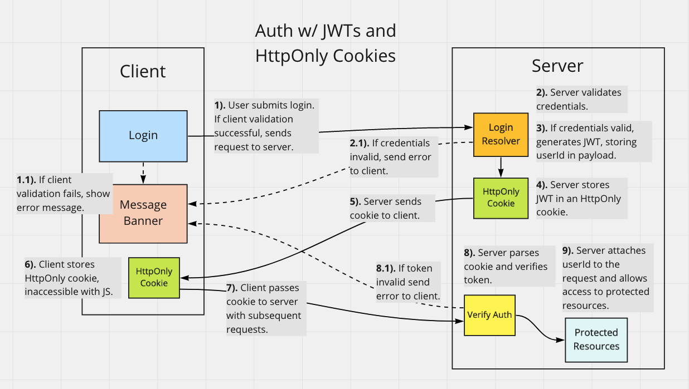

# Workout App

https://gymbuddie.netlify.app/

A full stack app for users to create and track their gym workouts.

<!-- 
TODO:
- Add more images to readme
- Add tech icons for technologies
-->

<!--
TODO: Screenshots of app here
-->

---

## Tech Used

### [Server](https://github.com/msolorio/workout-app)
- Node
- Apollo GraphQL
- Prisma ORM
- PostgreSQL
- JWT

### [Client](https://github.com/msolorio/workout-app-client)

- TypeScript
- React
- Apollo GraphQL
- Redux / Redux Toolkit
- React Router

#### [Expand Image - Right click to open in new tab](https://raw.githubusercontent.com/msolorio/workout_app/main/readme-assets/workout-app-architecture.png)


---

## Tech of Note

### Client Caching Strategy

<details>
  <summary>Learn More</summary>

<br>

Handled data persistence with Apollo GraphQL and kept a local cache of user data with Redux.
- Nearly instantaneous performance for data reads.
- Decreased load on the server based on app use.

Apollo GraphQL offers its own robust caching features. I chose to use Redux to practice coordinating two data stores and allow for optimistic updates in the future.

#### [Expand Image - Right click to open in new tab](https://raw.githubusercontent.com/msolorio/workout_app/main/readme-assets/client-data-strategy.png)


### Reflections and Future Features
A Redux cache worked well here. Users read only their own data removing the risk of being out of sync with the DB. In the future, I would like to add a social component using Redis for caching shared data among users.


</details>

---

### Client Organization

<details>
<summary>Learn More</summary>

<br>

Created separate abstractions for data and component UI, mimicking MVC.

#### [Expand Image - Right click to open in new tab](https://raw.githubusercontent.com/msolorio/workout_app/main/readme-assets/client-mvc.png)


### Redux and GraphQL Models
- Abstracts away vendor specific code for Apollo GraphQL and Redux
- Houses client-side error handling for Apollo GraphQL

### Client Operations Models
- Manages implementation details of communicating between GraphQL and Redux
- Presents high-level operations to the controllers

### Container Components (Controllers)
- Manage high-level coordination of page tasks.
- Retrieves URL data
- Calls model methods
- Manages component state
- Handles events and redirects
- Pulls in UI and passes data

### Presentation Components (View)
- Presents the data and styled UI

<br>

### Code Example - Create Workout Container Component

[See full code - right click to open in new tab](https://github.com/msolorio/workout_app_client/blob/main/src/pages/ShowWorkout/index.tsx)
```typescript
function CreateWorkout(): JSX.Element {
  const createWorkout = model.Workout.useCreateWorkout()

  const stateObj: State = {
    workoutId: null
  }

  const [state, setState] = useState(stateObj)


  const handleCreateWorkout = async (workoutData: WorkoutType) => {
    const createdWorkout: WorkoutType = await createWorkout(workoutData)

    if (createdWorkout.id) {
      setState({ workoutId: createdWorkout.id })
    }
  }

  if (state.workoutId) return <Redirect to={`/workouts/${state.workoutId}`} />

  return (
    <CreateWorkoutUi handleCreateWorkout={handleCreateWorkout} />
  )
}
```

---
### Code Example - Create Workout Model
`useCreateWorkout` creates a workout with Apollo GraphQL and stores in Redux. Hooks are used to manage model methods. In this case the hook returns a method to be invoked in an event handler.

[See full code - right click to open in new tab](https://github.com/msolorio/workout_app_client/blob/main/src/model/resources/Workout/index.ts)

```typescript
...
useCreateWorkout() {
  const createWorkoutGql = gql.Workout.useCreateWorkout()
  const createWorkoutRdx = rdx.Workout.useCreateWorkout()

  async function createWorkout(workoutData: WorkoutType): Promise<WorkoutOrErrorType> {
    const newWorkout = await createWorkoutGql(workoutData)

    if (!newWorkout.error) {
      createWorkoutRdx(newWorkout)
    }

    return newWorkout
  }

  return createWorkout
},
...
```

</details>

---

### Authentication with JWTs

<details>
  <summary>Learn More</summary>

  <br>

  Configured authentication with JWTs and HttpOnly Cookies.
  - Gaurded against XSS from accessing token.
  - Enabled stateless authentication with JWTs, eliminating the need to store session data server-side.
  - Revokes the HttpOnly cookie server-side upon logout.
  - Cookie is passed via HTTPS.
  - Cookie and token are short-lived, valid for only 24 hours.

#### [Expand Image - Right click to open in new tab](https://raw.githubusercontent.com/msolorio/workout_app/main/readme-assets/auth-jwt.png)



</details>

---

<!-- 
TODO: Combine Apollo GraphQL server section with Server Organization
-->

### Apollo GraphQL Server

<details>
  <summary>Learn More</summary>

<br>

Set up 5-model GraphQL API, enabling flexibility in traversing of data.

#### [Expand Image - Right click to open in new tab](https://raw.githubusercontent.com/msolorio/workout_app/main/readme-assets/workout-app-erd.png)


The client specifies the exact data it needs.


### Code Example
[Check out the resolvers dir for the GraphQL implementation - right click to open in new tab](https://github.com/msolorio/workout_app_server/tree/main/src/resolvers)

### Reflections and Future Features
Building the Apollo GraphQL server was intuitive and a joy. It is exciting to enable complete data flexibility. I'm interested in using GraphQL more and learning about the problems it solves in the real-world.

In the future I could add workout progress analysis features, where complex data fetching would be required. A feature could allow a user to see their progress overall, per workout, or per exercise.

</details>

---

### Server Organization

<details>
  <summary>Learn More</summary>

<br>

Decoupled the GraphQL API layer from data fetching layer.
- Allowing for easy repurposing of components.
- GraphQL could be switched out for a REST API.
- Prisma / Postgres model could be switched to accomodate a different database.


#### [Expand Image - Right click to open in new tab](https://raw.githubusercontent.com/msolorio/workout_app/main/readme-assets/server-org.png)


### Code Example

The Model method for creating a workout
- Abstracts away vendor specific code for Prisma.
- Manages multiple DB interactions involved with fullfilling single mutation.
- Closure wraps the model method and grant it error handling with `createHandledQuery`.

[See full code - right click to open in new tab](https://github.com/msolorio/workout_app_server/blob/main/src/model/Workout/methods/createWorkout.js)
```js
...
async function query({
  name,
  description,
  length,
  location,
  exercises,
  userId
}) {

  const newWorkout = await prisma.workout.create({
    data: {
      name: name,
      description: description,
      length: length,
      location: location,
      userId: Number(userId)
    }
  })

  if (exercises) {
    const formattedExercises = exercises.map(ex => {
      ex.workoutId = Number(newWorkout.id);
      return ex;
    })
  
    await prisma.exercise.createMany({
      data: formattedExercises
    })
  }

  return newWorkout;
}

const createWorkout = createHandledQuery(query)

return createWorkout
...
```
</details>

---

<!--
TODO: Move TypeScript out of drop down
-->

### TypeScript

<details>
  <summary>Learn More</summary>

<br>

The client is written entirely in TypeScript.

### Lessons Learned
- Became more aware of creating uniformity and a clear type strategy for my codebase.
- Developed faster, catching subtle bugs early (often before they became bugs).

### In-Progress
- Currently converting the backend to TypeScript.

</details>

---

### Docker

<details>
  <summary>Learn More</summary>

  <br>

- Configured Dockerfiles for both server and client.
- Configured single Docker Compose for 3-tier setup.
- Configured npm scripts to automate DB migration and seeding for local dev.

### Code Example

[See Docker Compose File - right click to open in new tab](https://github.com/msolorio/workout_app/blob/main/docker-compose.yml)

<!-- ```yml
version: "3.9"
services:
  workoutdb:
    image: postgres:latest
    container_name: workoutdb
    hostname: workoutdb
    ports:
      - 5432:5432
    environment:
      POSTGRES_USER: postgres
      POSTGRES_PASSWORD: postgres
      POSTGRES_DB: workout-app-dev
    volumes:
      - postgres-data:/var/lib/postgresql/data

  app:
    container_name: app
    build:
      context: ./server
      dockerfile: Dockerfile.dev
    depends_on:
      - workoutdb
    ports:
      - 4000:4000
    volumes:
      - ./server:/app
    command: npm run init-dev
    environment:
      DEVELOPMENT: true
      CLIENT_ENDPOINT: http://localhost:3000

  client:
    container_name: client
    build:
      context: ./client
      dockerfile: Dockerfile.dev
    ports:
      - 3000:3000
    environment:
      REACT_APP_API_ENDPOINT: http://localhost:4000
      FAST_REFRESH: false
    volumes:
      - ./client:/app

volumes:
  postgres-data:

``` -->
</details>

---

<br>

## Todo Items
This is an ongoing project with critical and non-critical features still to be built.
- Move unprotected routes to the Express server. Completely deny access to Apollo server for unauthenticated requests.
- Sanitize client inputs for XSS.
- Sanitize client inputs for SQL-injection.
- Improve related prisma queries for increased performance.
- Implement optimistic updates for data writes with Redux.
- Convert backend to TypeScript.
- Currently running into a bug where unable to disable Apollo caching for certain key queries.

  
## Future Implementations and Lessons Learned
- **Use Deno on server** - for Native TypeScript support and better TypeScript tooling.
- **Use ES Modules on server** - allow importing of TypeScript interfaces.
- **Use non-hook GraphQL queries/mutations on client** - simplify tiered model methods.
- **Add a social component** - allow users to share workouts, message one another, and find users based on location. Would use WebSockets for real-time and Redis for strategic caching of shared user data.
- **Add image upload with Amazon S3** - allow users to upload multiple images for a workout session.
- **Add CDN with CloudFront** - for improved performance for delivering frontend assets.
