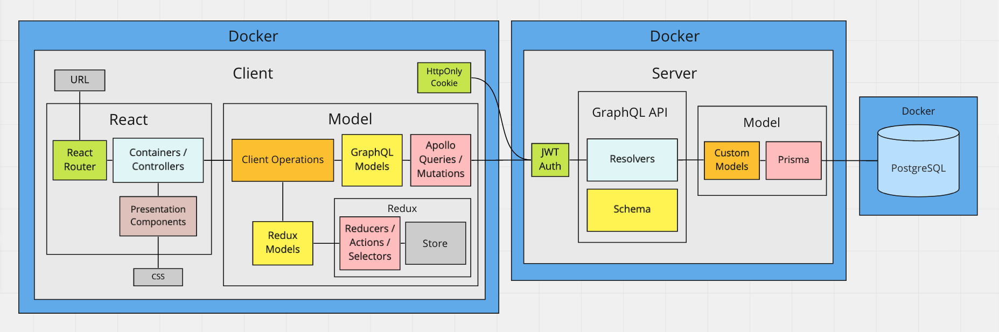

# Workout App

A full stack app for users to create and track their gym workouts.

The app uses Apollo GraphQL for the API layer while maintaining a local data cache via Redux.

---

#### Tech Used

### [Server](https://github.com/msolorio/workout-app)
- Node
- GraphQL / Apollo
- Prisma ORM
- PostgreSQL

### [Client](https://github.com/msolorio/workout-app-client)

- TypeScript
- React
- Redux - Redux toolkit
- GraphQL / Apollo

#### [Expand Image - Right click to open in new tab](https://raw.githubusercontent.com/msolorio/workout_app/main/readme-assets/workout-app-architecture.png)

---

## Tech of Note [WIP]

### Organizational Strategy - Client

Learn More

 

Implemented separate layers for data interaction and component UI, mimicking MVC architecture.

#### [Expand Image - Right click to open in new tab](https://raw.githubusercontent.com/msolorio/workout_app/main/readme-assets/client-mvc.png)

#### Models - Redux and GraphQL Models
- For abstracting away vendor specific code for GraphQL and Redux
- Housing error handling for GraphQL queries and mutations
- Uses React Hooks

#### Models - Client Operations Models
- For managing implementation details of communication between GraphQL and Redux
- Presenting high level operations to the controllers
- Uses React Hooks

#### Container Components (Controllers)
- For High level coordination of page level tasks
- Retrieving data from the URL
- Calling model methods for setting and retrieving data
- Managing local component state
- Handling events
- Handling redirects
- Pulling in UI and passing data

#### Presentation Components (View)
- Presenting data and styled UI

 

#### Code Example - Right click to open in new tab

- [ShowWorkout Container Component](https://github.com/msolorio/workout_app_client/blob/main/src/pages/ShowWorkout/index.tsx)
- [Workout Client Operations Models](https://github.com/msolorio/workout_app_client/blob/main/src/model/resources/Workout/index.ts)

---

### Organizational Strategy - Server

On Server
- Separated the GraphQL API layer from the ORM layer via a model abstraction
- Allows for switching out or repurposing the API layer and the model layer independantly

<!-- ### Data Handling Strategy on the Client
Used Apollo GraphQL hooks for persistent data storage while maintaining a local cache via Redux
  - Decreased load on the server by [xxx%]
  - Enabled nearly instantaneous performance for data reads

Allows for implementing optimistic updates as a future feature
- Updating user data and creating new records client-side before receiving a response from the server

**Note:** GraphQL does provide caching tools and arguably Redux was not needed for the current implementation. I opted to use Redux to practice managing and syncing both data stores and to allow for optimistic updates as a future feature.
 -->

### Apollo GraphQL
- Greatly enjoyed setting up the GraphQL server.
  - Managing the complexity of related models
  - Allowing for complete flexibility on the client
- Interested in using GraphQL more and learning more about the kinds of problems it solves in real-world scenarios
<!-- 
Go over GraphQL implementation
- how GraphQL works
- Response has same shape as the request
- Schema is contract between client and server
- Each field corresponds with a resolver - will resolve the data for that field
- Must manually resolve the fields for related models

- On client
  - Error handling for GraphQL requests
    - Implemented a custom error handling mechanism as
    - an opportunity to more deeply understand error handling with GraphQL

-->

### Redux
- Local cache of state
- Improved performance for data fetching
- Can allow for optimistic updates in the future

**Note:** Apollo GraphQL offers caching and one could say Redux was not necessary for this use case. I chose to implement Redux to practice coordinating the two data stores and to allow for optimistic updates as a future feature.

### TypeScript
<!-- 
Made me more conscious of how I was coding

TODO: tighten typescript code
 -->

### Docker

### JWT for Authentication

---

## App Organization
<!-- 
Abstracted away vendor specific code for Redux and GraphQL
- Created model interfaces for interacting with Redux and GraphQL
 -->

## In-Progress
- Currently moving the backend to TypeScript

## TODO Items
This is an ongoing project with critical and non-critical features still to be built.
- Completely convert the backend to TypeScript
- Gaurd against cross-site scripting for all client inputs
- Gaurd against SQL injection for all client inputs
- Improve related prisma queries to increase performance
- Implement optimistic updates for data mutations with Redux

## Future Implementations and Lessons Learned
- Use ES Modules on server to allow importing of TypeScript interfaces
