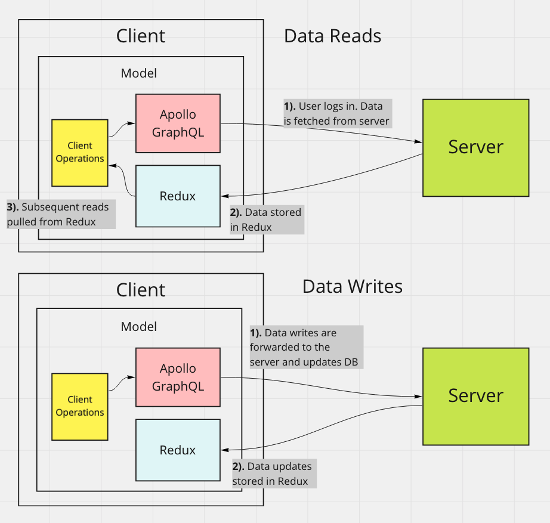

# Workout App

A full stack app for users to create and track their gym workouts.

The app uses Apollo GraphQL for the API layer while maintaining a local data cache via Redux.

---

#### Tech Used

### [Server](https://github.com/msolorio/workout-app)
- Node
- GraphQL / Apollo
- Prisma ORM
- PostgreSQL

### [Client](https://github.com/msolorio/workout-app-client)

- TypeScript
- React
- Redux - Redux toolkit
- GraphQL / Apollo

#### [Expand Image - Right click to open in new tab](https://raw.githubusercontent.com/msolorio/workout_app/main/readme-assets/workout-app-architecture.png)


---

## Tech of Note [WIP]

### Data On the Client

<details>
  <summary>Learn More</summary>

<br>

Configured server interaction with Apollo GraphQL while maintaining a local cache of user's data via Redux.
- Decreased load on the server by 200%.
- Nearly instantaneous performance for data reads.
- Allows for optimistic updates as a future feature - updating user data and creating new records client-side without waiting for a response from the server.

**Note:** Apollo GraphQL offers caching and keeping a local cache in Redux was not entirely needed. I chose to implement Redux to practice coordinating the two data stores and to allow for optimistic updates as a future feature.

<br>

#### [Expand Image - Right click to open in new tab](https://raw.githubusercontent.com/msolorio/workout_app/main/readme-assets/client-data-strategy.png)




</details>

---

<!-- - On client
  - Error handling for GraphQL requests
    - Implemented a custom error handling mechanism as
    - an opportunity to more deeply understand error handling with GraphQL -->


### Client Organization

<details>
<summary>Learn More</summary>

<br>

Created separate abstractions for data and component UI, mimicking MVC architecture. Container components manage high level coordination of page tasks. Model layers handle implementation details of working with data.

#### [Expand Image - Right click to open in new tab](https://raw.githubusercontent.com/msolorio/workout_app/main/readme-assets/client-mvc.png)


#### Redux and GraphQL Models
- Abstracts away vendor specific code for Apollo GraphQL and Redux
- Houses client-side error handling for GraphQL queries and mutations
- Uses React Hooks

#### Client Operations Models
- Manages implementation details of communication between GraphQL and Redux
- Presents high level operations to the controllers
- Uses React Hooks

#### Container Components (Controllers)
- Retrieves data from the URL
- Calls model methods for setting and retrieving data
- Manages local component state
- Handles events
- Handles redirects
- Pulls in UI and passing data

#### Presentation Components (View)
- Presents the data and styled UI

<br>

#### Code Example

The CreateWorkout container

[See full code - right click to open in new tab](https://github.com/msolorio/workout_app_client/blob/main/src/pages/ShowWorkout/index.tsx)
```typescript
function CreateWorkout(): JSX.Element {
  const createWorkout = model.Workout.useCreateWorkout()

  const stateObj: State = {
    workoutId: null
  }

  const [state, setState] = useState(stateObj)


  const handleCreateWorkout = async (workoutData: WorkoutType) => {
    const createdWorkout: WorkoutType = await createWorkout(workoutData)

    if (createdWorkout.id) {
      setState({ workoutId: createdWorkout.id })
    }
  }

  if (state.workoutId) return <Redirect to={`/workouts/${state.workoutId}`} />

  return (
    <CreateWorkoutUi handleCreateWorkout={handleCreateWorkout} />
  )
}
```

---

`useCreateWorkout` method creates a workout with Apollo GraphQL, then stores in Redux. To integrate with Apollo hooks, I used hooks to manage model methods. The `useCreateWorkout` hook is called at the component's top level and returns a function that can be invoked in an event handler.

[See full code - right click to open in new tab](https://github.com/msolorio/workout_app_client/blob/main/src/model/resources/Workout/index.ts)

```typescript
...
useCreateWorkout() {
  const createWorkoutGql = gql.Workout.useCreateWorkout()
  const createWorkoutRdx = rdx.Workout.useCreateWorkout()

  async function createWorkout(workoutData: WorkoutType): Promise<WorkoutOrErrorType> {
    const newWorkout = await createWorkoutGql(workoutData)

    if (!newWorkout.error) {
      createWorkoutRdx(newWorkout)
    }

    return newWorkout
  }

  return createWorkout
},
...
```

</details>

---

### Apollo GraphQL Server

<details>
  <summary>Learn More</summary>

<br>

Set up 5-model GraphQL API and enabling flexibility in traversing of data.
- In the future I could add workout progress analysis features, where complex data fetching would be required. For example, a feature could allow a user to see their progress overall, per workout, or per exercise.

#### [Expand Image - Right click to open in new tab](https://raw.githubusercontent.com/msolorio/workout_app/main/readme-assets/workout-app-erd.png)


The client can specify the exact data it needs.


#### Code Example
[Check out the resolvers dir for the GraphQL implementation - right click to open in new tab](https://github.com/msolorio/workout_app_server/tree/main/src/resolvers)

Building the Apollo GraphQL server was intuitive and a joy, and it is exciting to enable complete data flexibility. I'm interested in using GraphQL more and learning about the problems it solves in the real-world.

</details>

---

### Server Organization

<details>
  <summary>Learn More</summary>

<br>

Decoupled the GraphQL API layer from data fetching layer allowing for easy repurposing of components. GraphQL could be switched out for a REST API, or the Prisma / Postgres model could be switched to accomodate a different database.

#### Code Example
Shown is the resolver and model layer for creating a workout.

**Note:** In the model, closure is used to wrap the model method and grant it error handling with `createHandledQuery`.

```js
// Resolver Code
...
  createWorkout: async (parent, args, context) => {
    const modelArgs = {
      ...args,
      userId: context.userId
    }

    const { createdWorkout } = await Workout.createWorkout(modelArgs)

    return createdWorkout
  },
...

// Model Code
...
async function query({
  name,
  description,
  length,
  location,
  exercises,
  userId
}) {

  const newWorkout = await prisma.workout.create({
    data: {
      name: name,
      description: description,
      length: length,
      location: location,
      userId: Number(userId)
    }
  })

  if (exercises) {
    const formattedExercises = exercises.map(ex => {
      ex.workoutId = Number(newWorkout.id);
      return ex;
    })
  
    await prisma.exercise.createMany({
      data: formattedExercises
    })
  }

  return newWorkout;
}

const createWorkout = createHandledQuery(query)

return createWorkout
...
```
</details>

---

### TypeScript

<details>
  <summary>Learn More</summary>

<br>

The client is written entirely in TypeScript.

#### Lessons Learned
- Became more aware of creating uniformity and a clear type strategy for my codebase
- Developed faster, catching subtle bugs early (often before they became bugs)

#### In-Progress
- Currently converting the backend to TypeScript

</details>

---

### Docker

<details>
  <summary>Learn More</summary>

  <br>

Configured Dockerfiles for both server and client and configured a single Docker Compose file for server, client, and database.

[See full code - right click to open in new tab](https://github.com/msolorio/workout_app/blob/main/docker-compose.yml)

#### Code Example
```yml
version: "3.9"
services:
  workoutdb:
    image: postgres:latest
    container_name: workoutdb
    hostname: workoutdb
    ports:
      - 5432:5432
    environment:
      POSTGRES_USER: postgres
      POSTGRES_PASSWORD: postgres
      POSTGRES_DB: workout-app-dev
    volumes:
      - postgres-data:/var/lib/postgresql/data

  app:
    container_name: app
    build:
      context: ./server
      dockerfile: Dockerfile.dev
    depends_on:
      - workoutdb
    ports:
      - 4000:4000
    volumes:
      - ./server:/app
    command: npm run init-dev

  client:
    container_name: client
    build:
      context: ./client
      dockerfile: Dockerfile.dev
    ports:
      - 3000:3000
    environment:
      REACT_APP_API_ENDPOINT: http://localhost:4000
      FAST_REFRESH: false
    volumes:
      - ./client:/app


volumes:
  postgres-data:
```
</details>

---

### JWT for Authentication

<details>
  <summary>Learn More</summary>

Configured authentication with JWTs and HttpOnly Cookies.

Security Considerations
- Gaurded against XSS from accessing token. HttpOnly cookies are inaccessible with JavaScript.
- Enabled stateless authentication with JWTs, eliminating the need to store session data server-side.
- Revokes the HttpOnly cookie server-side upon logout.
- Cookie is passed via HTTPS.
- Cookie and token are short-lived, valid for only 24 hours.

  <br>

#### [Expand Image - Right click to open in new tab](https://raw.githubusercontent.com/msolorio/workout_app/main/readme-assets/auth-jwt.png)


<!-- 
- A standard for securely transmitting information between parties
- JWTs can ve verified because they are digitally signed
- Signiture is generated with the header and payload
  - verifies the JWT has not been tampered with

Session data does not need to be stored on the server
- Implementation is completely stateless 

- token expires in 24 hours

Security issues
- Store in HttpOnly cookie - inaccessible by JavaScript, XSS attacks
- Cookie and token expires in 24 hours
- revokes the HttpOnly cookie serverside when user logs out
- Uses HTTPS for app

- do not store sensitive data in the token
- do not allow it to be valid longer than necessary

Future
- sanitize user inputs

 -->

</details>

---

<br>

## TODO Items
This is an ongoing project with critical and non-critical features still to be built.
- Move unprotected routes to the Express server. Completely deny access to Apollo server for unauthenticated requests.
- Sanitize client inputs for XSS attacks.
- Sanitize client inputs for SQL-injection attacks.
- Improve related prisma queries for increased performance.
- Implement optimistic updates for data mutations with Redux.
- Convert backend to TypeScript.

## Future Implementations and Lessons Learned
- **Use Deno instead of NodeJs** - for Native TypeScript support and better TypeScript tooling
- **Use ES Modules on server** - allow importing of TypeScript interfaces
- **Use non-hook GraphQL queries/mutations on client** - simplify model methods